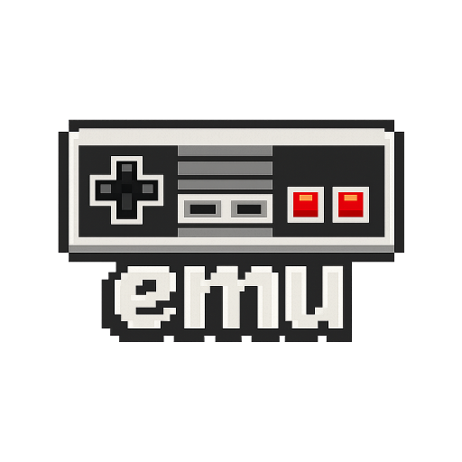

[](https://github.com/bearswithsaws/emu/actions/workflows/ci.yml)

# emu



A cycle-accurate NES emulator written in C with an SDL2/Dear ImGui frontend.

## Features

- **Accurate 6502 CPU** — all 56 legal opcodes + commonly-used illegal opcodes; passes nestest (all official + illegal opcode tests)
- **PPU** — background + sprite rendering, loopy scrolling, 8×8 and 8×16 sprites, sprite 0 hit, OAM DMA, open bus behavior, even/odd frame dot-skip
- **APU** — all 5 channels (pulse ×2, triangle, noise, DMC), hardware-accurate nonlinear mixer, SDL2 audio queue output
- **13 mappers** — NROM (0), MMC1 (1), UxROM (2), CNROM (3), MMC3 (4), AxROM (7), MMC2/PxROM (9), Color Dreams (11), Namco 163 (19), Sunsoft FME-7 (69), Camerica (71), GxROM (66)
- **Keyboard + gamepad input** — SDL2 GameController API with hot-plug; two players; analog stick → d-pad
- **Save states** — 5 slots, F2–F6 / Shift+F2–F6 shortcuts; battery-backed SRAM persistence
- **Rewind** — hold Backspace to rewind up to 30 seconds
- **TAS support** — frame-level input recording and playback (`.tasr` format)
- **Speed control** — 50% / 100% / 200% / uncapped; Tab for instant fast-forward
- **Screenshot capture** — F9 saves a timestamped BMP
- **Debug tools** — CPU debugger with disassembly, editable registers, execute/read/write breakpoints, step/step-over; PPU viewer (pattern tables, nametables, OAM); hex memory viewer
- **iNES 1.0 and 2.0** ROM format support
- **Cross-platform** — Linux and Windows

## Building

### Linux (Ubuntu/Debian)

```bash
sudo apt-get install build-essential cmake libsdl2-dev libgtk-3-dev pkg-config
```

```bash
cmake -B build -DCMAKE_BUILD_TYPE=Debug
cmake --build build
```

The executable is at `build/emu`.

### Windows (MSVC + vcpkg)

Prerequisites: Visual Studio 2022 and [vcpkg](https://github.com/microsoft/vcpkg).

```powershell
# Install static SDL2 (one-time)
vcpkg install sdl2:x64-windows-static

# Configure (adjust TOOLCHAIN_FILE to your vcpkg install location)
cmake -B build `
  -G "Visual Studio 17 2022" -A x64 `
  -DCMAKE_TOOLCHAIN_FILE="<vcpkg-root>/scripts/buildsystems/vcpkg.cmake" `
  -DVCPKG_TARGET_TRIPLET=x64-windows-static `
  -DCMAKE_BUILD_TYPE=Debug

# Build
cmake --build build --config Debug --parallel
```

The executable is at `build\Debug\emu.exe`. SDL2 is statically linked — no DLLs required.

**VS Code (CMake Tools extension):** add to `.vscode/settings.json`:

```json
{
  "cmake.configureArgs": [
    "-DCMAKE_TOOLCHAIN_FILE=<vcpkg-root>/scripts/buildsystems/vcpkg.cmake",
    "-DVCPKG_TARGET_TRIPLET=x64-windows-static"
  ]
}
```

## Usage

```bash
# Open a ROM directly
./emu path/to/rom.nes

# Launch the GUI without a ROM (use File → Open ROM or drag-and-drop)
./emu
```

## Controls

| Action | Keyboard (P1) | Keyboard (P2) | Gamepad |
|--------|--------------|--------------|---------|
| D-Pad | Arrow keys | W A S D | D-pad / left stick |
| A | Z | N | A / Y |
| B | X | M | B / X |
| Start | Enter | Y | Start |
| Select | Right Shift | H | Back / Select |

**Emulator shortcuts:**

| Action | Key |
|--------|-----|
| Fast-forward (hold) | Tab |
| Rewind (hold) | Backspace |
| Save state slot 1–5 | F2–F6 |
| Load state slot 1–5 | Shift+F2–F6 |
| Screenshot | F9 |
| Pause / Resume | F1 (toggles menu bar) |
| Fullscreen | F11 |
| Step (debugger) | F7 |
| Step Over (debugger) | F8 |

## Releases

Pre-built binaries for Linux (AppImage) and Windows (zip) are published automatically when a version tag is pushed. See the [Releases](../../releases) page.

To cut a release:
```bash
git tag v0.1.0 && git push --tags
```

## Project Structure

```
emu.c                   — main loop, SDL init, ROM load
arch/6502/              — CPU, PPU, APU, mappers, bus, input, save state, rewind, TAS
lib/display/            — SDL2 window/render abstraction
lib/ui/                 — Dear ImGui panels and menu bar
tests/                  — unit tests (CTest) + Blargg headless runner
```

## Testing

```bash
cd build
ctest --output-on-failure
```

15 test suites covering CPU, PPU, APU, all mappers, and the disassembler. Optionally runs Blargg accuracy ROMs if `-DBLARGG_TEST_ROMS_PATH=<dir>` is set.

## Contributing

Bug reports and pull requests are welcome. Please run `clang-format` before submitting:

```bash
clang-format -i *.c *.h arch/6502/*.c arch/6502/*.h
```

## License

MIT License — see [LICENSE](LICENSE) for details.
